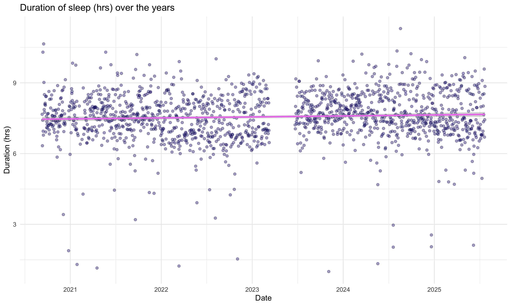
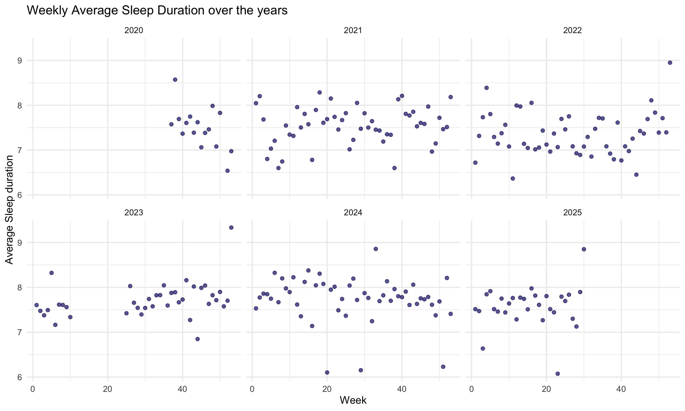
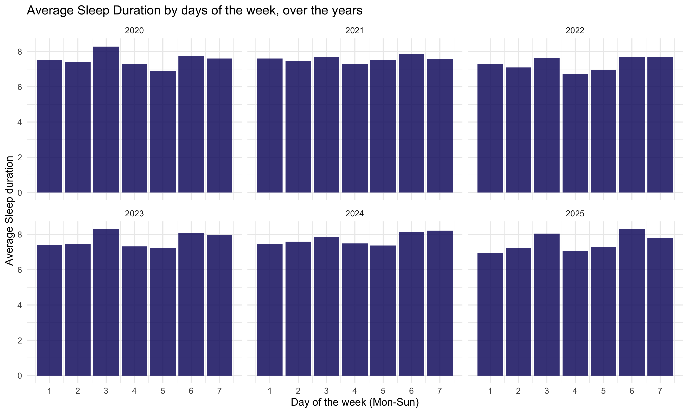
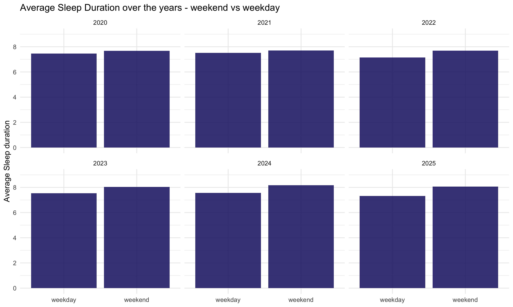
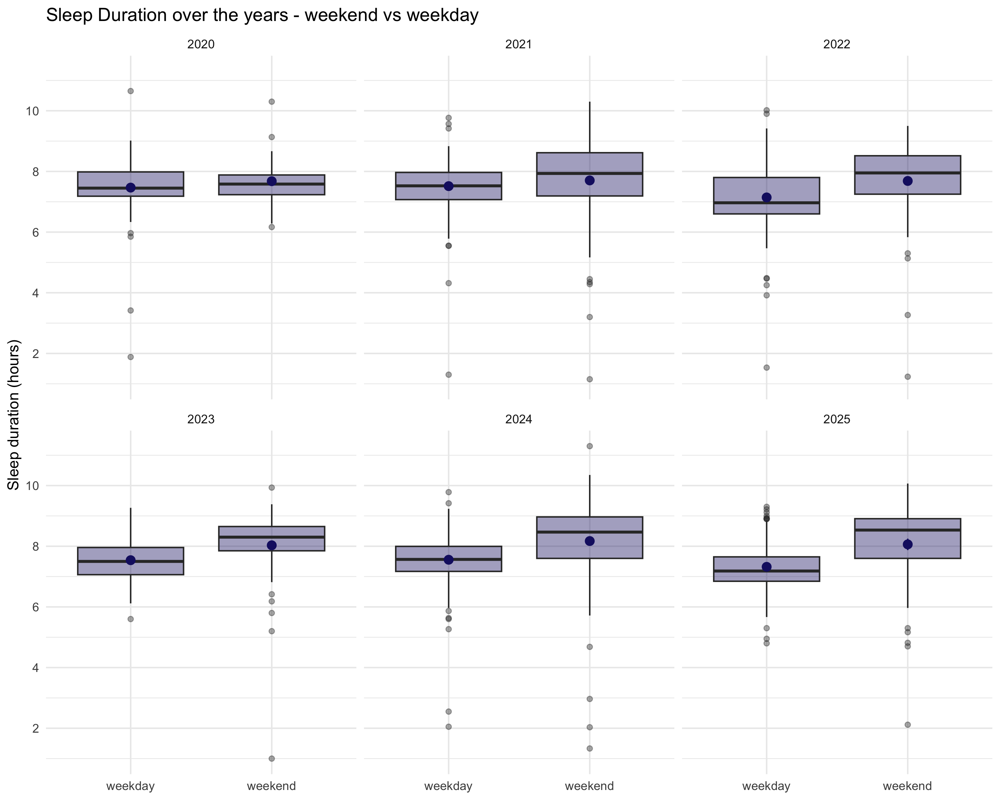

Sleep Analysis
================
WK
2025-12-08

- [Data structure](#data-structure)
- [EDA of the main sleep parameters](#eda-of-the-main-sleep-parameters)
  - [Initial clean up](#initial-clean-up)
  - [How did my sleep duration and its effeciency changed over
    time?](#how-did-my-sleep-duration-and-its-effeciency-changed-over-time)
  - [What is my average length of sleep by week and by day of the
    week?](#what-is-my-average-length-of-sleep-by-week-and-by-day-of-the-week)
  - [What is the gap in sleep duration between weekdays and
    weekends?](#what-is-the-gap-in-sleep-duration-between-weekdays-and-weekends)
  - [Investigate discrepancy between `sleep_summary` &
    `sleep_details`](#investigate-discrepancy-between-sleep_summary--sleep_details)
  - [Investigate duplicate observations in `sleep_summary` &
    `sleep_details`](#investigate-duplicate-observations-in-sleep_summary--sleep_details)
  - [Deep sleep - how long does it last and what time does it usually
    start?](#deep-sleep---how-long-does-it-last-and-what-time-does-it-usually-start)
  - [What is the “best” time to go to sleep? i.e. time of falling asleep
    vs duration of deep
    sleep.](#what-is-the-best-time-to-go-to-sleep-ie-time-of-falling-asleep-vs-duration-of-deep-sleep)
  - [How does the sleep `score_score` compare to the
    `sleep_summary$efficiency`?](#how-does-the-sleep-score_score-compare-to-the-sleep_summaryefficiency)
- [Write to CSV](#write-to-csv)

### Data structure

By using `sleep_inventory_parser.R` we created a `sleep_data` list
object, which holds information on:

    ##                                      Length Class       Mode
    ## device_temperature                    3     spec_tbl_df list
    ## minute_spo2                           2     spec_tbl_df list
    ## heart_rate_variability_details        5     spec_tbl_df list
    ## computed_temperature                  9     spec_tbl_df list
    ## sleep_score                           9     spec_tbl_df list
    ## respiratory_rate_summary             13     spec_tbl_df list
    ## daily_heart_rate_variability_summary  4     spec_tbl_df list
    ## daily_respiratory_rate_summary        2     spec_tbl_df list
    ## daily_spo2                            4     spec_tbl_df list
    ## sleep_summary                        19     tbl_df      list
    ## sleep_details                         5     tbl_df      list

It was temporarily stored as `sleep_data.rds` object, which then can be
used to produce the CSV files - see “Write to CSV” section at the
bottom.

------------------------------------------------------------------------

### EDA of the main sleep parameters

#### Initial clean up

Duration is a difference between sleep’s `endTime` & `startTime` in
milliseconds. This needs changing to time in hours.

``` r
main_sleep <- sleep_data$sleep_summary

main_sleep <- main_sleep |> 
  mutate(duration_hr = duration / 1000 / 3600,
         timeInBed_hr = timeInBed / 60, 
         .after = duration) |> 
  select(logId:logType) |> 
  distinct(logId, .keep_all = TRUE)
```

Check if `timeInBed` expressed in hours is equal to `duration` expressed
in hour:

``` r
sum(main_sleep$timeInBed_hr != main_sleep$duration_hr)
```

    ## [1] 0

No differences identified. By default, `timeInBed` represents duration
but expressed in minutes.

------------------------------------------------------------------------

#### How did my sleep duration and its effeciency changed over time?

``` r
main_sleep |> 
  ggplot(aes(x = dateOfSleep, y = duration_hr)) +
  geom_point(alpha = 0.4, color = "midnightblue") +
  geom_smooth(method = "lm", color = "violet") +
  labs(
    title = "Duration of sleep (hrs) over the years",
    x = "Date",
    y = "Duration (hrs)"
  ) +
  theme_minimal()
```

<!-- -->

Based on the initial look at the plot - LM suggest a marginal
improvement in the overall trend, i.e. increasing length of sleep, and
around mid-2023 we can observe more consistency and concentration of the
sleep duration around the line.

Starting from 2025 the duration seems to be spread further from the
line, concentrating more on the upper and lower extremes.

------------------------------------------------------------------------

#### What is my average length of sleep by week and by day of the week?

``` r
#Extract day & weekday from the date
main_sleep <- main_sleep |> 
  mutate(year = year(dateOfSleep),
         week = week(dateOfSleep),
         weekday = wday(dateOfSleep, week_start = 1),
         .after = dateOfSleep)

#Plot weekly average sleep duration over the year
main_sleep |>
  group_by(year, week) |>
  summarise(avg_duration_hr = mean(duration_hr),
            med_duration_hr = median(duration_hr)) |> 
  ggplot(aes(x = week, y = avg_duration_hr)) +
  geom_point(alpha = 0.7, color = "midnightblue") +
  labs(
    title = "Weekly Average Sleep Duration over the years",
    x = "Week",
    y = "Average Sleep duration"
  ) +
  facet_wrap(~year) +
  theme_minimal()
```

<!-- -->

Majority of the observed average sleep time is **between 7.5 to 8hrs**.
There is some improvement over the years, as in years **2020-2022**
lower end was closer to an **average of 7 hrs** a day. **2024** seems to
have the highest average duration - this is verified below.

**2023** has a gap between weeks 10 and 25 - that is when the old device
went out and before I got a replacement.

There are some outliers with exceptionally low/high average sleep
duration. Higher-end outliers could be due to weeks off from the
activities (so called deload weeks) - *worth investigating during the
review of activities.*

``` r
#Verify what year has the highest average sleep duration
main_sleep |> 
  group_by(year) |> 
  summarise(avg_sleep_duration = round_hms(hms(hours = mean(duration_hr)), secs = 60)) |> 
  arrange(desc(avg_sleep_duration))
```

<div class="kable-table">

| year | avg_sleep_duration |
|-----:|:-------------------|
| 2024 | 07:44:00           |
| 2023 | 07:41:00           |
| 2021 | 07:34:00           |
| 2020 | 07:32:00           |
| 2025 | 07:32:00           |
| 2022 | 07:18:00           |

</div>

------------------------------------------------------------------------

#### What is the gap in sleep duration between weekdays and weekends?

Two different ways to look at it:

**What’s the overall trend on each day of the week?**

``` r
main_sleep |> 
  group_by(year, weekday) |> 
  summarize(avg_duration_hr = mean(duration_hr)) |> 
  ggplot(aes(x = weekday, y = avg_duration_hr)) +
  geom_col(alpha = 0.85, fill = "midnightblue") +
  facet_wrap(~year) + 
  labs(
    title = "Average Sleep Duration by days of the week, over the years",
    x = "Day of the week (Mon-Sun)",
    y = "Average Sleep duration"
  ) +
  theme_minimal() +
  scale_x_continuous(breaks = 1:7)
```

<!-- -->

General observations:

- Wednesdays on averages show fairly similar sleep duration compared to
  weekends (usually day off from training)
- Based on 2025 data - Mondays and Thursdays seem to have the lowest
  average length of sleep - to be considered for improvement

**What’s the difference between weekdays and weekends?**

``` r
main_sleep <- main_sleep |> 
  mutate(weekday_type = if_else(weekday >= 6, "weekend", "weekday"),
         .after = weekday)
main_sleep |> 
  group_by(year, weekday_type) |> 
  summarize(avg_duration_hr = mean(duration_hr)) |> 
  ggplot(aes(x = weekday_type, y = avg_duration_hr)) +
  geom_col(alpha = 0.85, fill = "midnightblue") +
  facet_wrap(~year) + 
  scale_y_continuous(limits = c(0, 9), breaks = seq(0, 9, 2)) +
  labs(
    title = "Average Sleep Duration over the years - weekend vs weekday",
    x = element_blank(),
    y = "Average Sleep duration"
  ) + 
  theme_minimal()
```

<!-- -->

Unfortunately, the bar plot doesn’t paint the best picture in this
context.

Summary statistics of Sleep Duration over the years, shown on a boxplot.

``` r
main_sleep |> 
  ggplot(aes(x = weekday_type, y = duration_hr)) +
  geom_boxplot(alpha = 0.4, fill = "midnightblue") +
  facet_wrap(~year) +
  labs(
    title = "Sleep Duration over the years - weekend vs weekday",
    x = element_blank(),
    y = "Sleep duration (hours)"
  ) +
  scale_y_continuous(breaks = seq(0, 10, 2)) +
  theme_minimal() +
  stat_summary(color = "midnightblue") 
```

<!-- -->
Analyzing the summary statistics, we can note few observations:

- **2020 is the only year** with a similar spread in length of sleep on
  both weekdays & weekends
- Outliers on weekdays **are present on both ends of the boxplot** -
  they correspond to sleep of under 6 hrs and over 9 hrs
- Outliers on weekends are **almost exclusively** present on the lower
  end of the sleep’s length - ranging from 1hr to under 6 hrs,
  suggesting “sleepless nights”
- 50% of the registered sleep tends to last between **6-7 hrs on
  weekends** and **7.5-9 hrs on weekends**
- 2025 shows **many higher-end outliers on weekdays**, where sleep
  lasted roughly 9 hrs - suggesting those could be Wednesdays (days off
  from the training). Additionally, there is more significant gap
  between the weekdays vs weekends, compared to previous years, as the
  boxes almost do not overlap.

``` r
main_sleep |> 
  group_by(weekday_type) |> 
  summarize(avg_duration_hr = mean(duration_hr)) |> 
  mutate(diff_m = round_hms(hms(hours = (avg_duration_hr - lag(avg_duration_hr))), secs = 60))
```

<div class="kable-table">

| weekday_type | avg_duration_hr | diff_m   |
|:-------------|----------------:|:---------|
| weekday      |        7.424229 | NA       |
| weekend      |        7.901615 | 00:29:00 |

</div>

Throughout the years, on average sleep is longer by **~29 mins** during
weekends.

------------------------------------------------------------------------

#### Investigate discrepancy between `sleep_summary` & `sleep_details`

It was noted that when observations are grouped by night (`logId`), the
`sleep_details` do not match with the `sleep_summary`.

``` r
sleep_compare <- sleep_data$sleep_summary |> 
  select(logId, summary_id, summary_minutes) |> 
  left_join(sleep_data$sleep_details |>
              summarize(level_minutes = sum(seconds) / 60, 
                        .by = c(logId, dateOfSleep, level)),
            by = join_by(logId == logId, summary_id == level)) |> 
  mutate(diff_min = summary_minutes - level_minutes) |> 
  ungroup()

head(sleep_compare)
```

<div class="kable-table">

|       logId | summary_id | summary_minutes | dateOfSleep | level_minutes | diff_min |
|------------:|:-----------|----------------:|:------------|--------------:|---------:|
| 29189152978 | deep       |              60 | 2020-10-08  |         122.0 |    -62.0 |
| 29189152978 | wake       |              38 | 2020-10-08  |          76.0 |    -38.0 |
| 29189152978 | light      |             220 | 2020-10-08  |         478.0 |   -258.0 |
| 29189152978 | rem        |             102 | 2020-10-08  |         214.0 |   -112.0 |
| 29173105821 | deep       |             108 | 2020-10-07  |         112.5 |     -4.5 |
| 29173105821 | wake       |              50 | 2020-10-07  |          51.0 |     -1.0 |

</div>

`Diff` tells by how much summary is over/understated compared to
details.

Check by how much each sleep stage differs in the summary table vs
details table:

``` r
sleep_compare |> 
  summarize(avg_diff_min = round(mean(diff_min), 2), .by = summary_id)
```

<div class="kable-table">

| summary_id | avg_diff_min |
|:-----------|-------------:|
| deep       |        -6.21 |
| wake       |        -3.22 |
| light      |       -32.60 |
| rem        |       -12.12 |
| restless   |        -0.72 |
| awake      |           NA |
| asleep     |       -40.36 |

</div>

The most significant difference on average is observed in values of
`asleep`, where data for `details` captures longer duration of the stage
compared to `summary` (**40 mins**).

This seems to be due to the fact that `light` and `rem` last shorter in
the `summary` table by **32 mins** and **12 mins** respectively.

The difference is not explained in the documentation and my assumptions
are that the there is some back-end logic which sifts through the data
gathered into details before summary output is produced.

------------------------------------------------------------------------

#### Investigate duplicate observations in `sleep_summary` & `sleep_details`

There seems to be duplicate entries for some of the nights, where
`level_start` timestamp is exactly the same (no two occurrences can
start at the same time).

As an example it was seen in `logID == 29189152978`.

``` r
sleep_data$sleep_details |> 
  filter(logId == 29189152978, level == "deep") |> 
  arrange(dateTime)
```

<div class="kable-table">

|       logId | dateOfSleep | dateTime                | level | seconds |
|------------:|:------------|:------------------------|:------|--------:|
| 29189152978 | 2020-10-08  | 2020-10-08T00:11:00.000 | deep  |     420 |
| 29189152978 | 2020-10-08  | 2020-10-08T00:11:00.000 | deep  |     420 |
| 29189152978 | 2020-10-08  | 2020-10-08T01:47:30.000 | deep  |     300 |
| 29189152978 | 2020-10-08  | 2020-10-08T01:47:30.000 | deep  |     300 |
| 29189152978 | 2020-10-08  | 2020-10-08T02:09:00.000 | deep  |     450 |
| 29189152978 | 2020-10-08  | 2020-10-08T02:09:00.000 | deep  |     450 |
| 29189152978 | 2020-10-08  | 2020-10-08T02:56:30.000 | deep  |    1260 |
| 29189152978 | 2020-10-08  | 2020-10-08T02:56:30.000 | deep  |    1260 |
| 29189152978 | 2020-10-08  | 2020-10-08T04:28:00.000 | deep  |    1230 |
| 29189152978 | 2020-10-08  | 2020-10-08T04:28:00.000 | deep  |    1230 |

</div>

The same can be observed for both summary and details.

``` r
sleep_data$sleep_summary |> 
  filter(logId == 29189152978)
```

<div class="kable-table">

| logId | dateOfSleep | startTime | endTime | duration | minutesToFallAsleep | minutesAsleep | minutesAwake | minutesAfterWakeup | timeInBed | efficiency | type | infoCode | logType | summary_count | summary_minutes | summary_thirtyDayAvgMinutes | summary_id | mainSleep |
|---:|:---|:---|:---|---:|---:|---:|---:|---:|---:|---:|:---|---:|:---|---:|---:|---:|:---|:---|
| 29189152978 | 2020-10-08 | 2020-10-07 23:14:00 | 2020-10-08 06:14:00 | 25200000 | 0 | 382 | 38 | 1 | 420 | 97 | stages | 0 | auto_detected | 5 | 60 | 84 | deep | TRUE |
| 29189152978 | 2020-10-08 | 2020-10-07 23:14:00 | 2020-10-08 06:14:00 | 25200000 | 0 | 382 | 38 | 1 | 420 | 97 | stages | 0 | auto_detected | 33 | 38 | 48 | wake | TRUE |
| 29189152978 | 2020-10-08 | 2020-10-07 23:14:00 | 2020-10-08 06:14:00 | 25200000 | 0 | 382 | 38 | 1 | 420 | 97 | stages | 0 | auto_detected | 28 | 220 | 226 | light | TRUE |
| 29189152978 | 2020-10-08 | 2020-10-07 23:14:00 | 2020-10-08 06:14:00 | 25200000 | 0 | 382 | 38 | 1 | 420 | 97 | stages | 0 | auto_detected | 12 | 102 | 112 | rem | TRUE |
| 29189152978 | 2020-10-08 | 2020-10-07 23:14:00 | 2020-10-08 06:14:00 | 25200000 | 0 | 382 | 38 | 1 | 420 | 97 | stages | 0 | auto_detected | 5 | 60 | 0 | deep | TRUE |
| 29189152978 | 2020-10-08 | 2020-10-07 23:14:00 | 2020-10-08 06:14:00 | 25200000 | 0 | 382 | 38 | 1 | 420 | 97 | stages | 0 | auto_detected | 33 | 38 | 0 | wake | TRUE |
| 29189152978 | 2020-10-08 | 2020-10-07 23:14:00 | 2020-10-08 06:14:00 | 25200000 | 0 | 382 | 38 | 1 | 420 | 97 | stages | 0 | auto_detected | 28 | 220 | 0 | light | TRUE |
| 29189152978 | 2020-10-08 | 2020-10-07 23:14:00 | 2020-10-08 06:14:00 | 25200000 | 0 | 382 | 38 | 1 | 420 | 97 | stages | 0 | auto_detected | 12 | 102 | 0 | rem | TRUE |

</div>

Check the count of observations for each night.

A single date of sleep with non-duplicate entries is expected to have 4
lines - for each of the levels (deep, wake, light, rem)

``` r
sleep_data$sleep_summary |>
  count(logId, startTime, sort = TRUE, name = "n_observations") |> 
  filter(n_observations > 4) |> 
  head()
```

<div class="kable-table">

|       logId | startTime           | n_observations |
|------------:|:--------------------|---------------:|
| 29189152978 | 2020-10-07 23:14:00 |              8 |
| 29632708452 | 2020-11-07 01:21:00 |              8 |
| 30014605741 | 2020-12-07 00:04:30 |              8 |
| 30402983161 | 2021-01-06 00:17:30 |              8 |
| 31216003223 | 2021-03-07 01:02:30 |              8 |
| 31629168355 | 2021-04-06 00:30:00 |              8 |

</div>

``` r
sleep_data$sleep_details |> 
  count(logId, dateTime, sort = TRUE, name = "n_observations") |> 
  filter(n_observations > 1) |> 
  #summarize(dupes = sum(n_observations - 1)) |> 
  head()
```

<div class="kable-table">

|       logId | dateTime                | n_observations |
|------------:|:------------------------|---------------:|
| 29189152978 | 2020-10-08T01:52:30.000 |              4 |
| 29632708452 | 2020-11-07T01:21:00.000 |              4 |
| 30402983161 | 2021-01-06T02:41:00.000 |              4 |
| 32849145614 | 2021-07-05T04:18:30.000 |              4 |
| 34020446763 | 2021-10-03T02:05:30.000 |              4 |
| 34759656044 | 2021-12-01T23:59:30.000 |              4 |

</div>

There are **51 instances** of duplicated data in the
`sleep_data$sleep_summary` table, which translates to roughly **3.8k of
duplicated lines**.

The duplicated values **did not cause any disruptions** to the initial
EDA done with the use of `sleep_main`, as it was reduced to show only
the distinct values. This finding however, required a tweak to the
following section focused on Deep Sleep analysis.

------------------------------------------------------------------------

#### Deep sleep - how long does it last and what time does it usually start?

To answer this question use `sleep_details`, which marks the start and
end time of the stage.

``` r
sleep_deep <- sleep_data$sleep_details |> 
  arrange(dateTime) |> 
  filter(level == "deep") |> 
  mutate(level_start = ymd_hms(dateTime),
         level_end = ymd_hms(dateTime) + seconds,
         full_hr_start = hour(level_start),
         full_hr_end = hour(level_end)) |> 
  select(logId, level, level_start, full_hr_start, level_end, full_hr_end, seconds) |> 
  distinct()
head(sleep_deep)
```

<div class="kable-table">

| logId | level | level_start | full_hr_start | level_end | full_hr_end | seconds |
|---:|:---|:---|---:|:---|---:|---:|
| 28814957423 | deep | 2020-09-10 00:44:00 | 0 | 2020-09-10 01:03:00 | 1 | 1140 |
| 28814957423 | deep | 2020-09-10 01:12:30 | 1 | 2020-09-10 01:18:00 | 1 | 330 |
| 28814957423 | deep | 2020-09-10 02:30:00 | 2 | 2020-09-10 02:36:30 | 2 | 390 |
| 28814957423 | deep | 2020-09-10 06:12:30 | 6 | 2020-09-10 06:52:00 | 6 | 2370 |
| 28828622611 | deep | 2020-09-11 00:23:30 | 0 | 2020-09-11 01:10:00 | 1 | 2790 |
| 28828622611 | deep | 2020-09-11 03:31:00 | 3 | 2020-09-11 03:38:00 | 3 | 420 |

</div>

Assess what is the average length of deep sleep registered for the time
intervals marked by the full hour.

``` r
sleep_deep |> 
  summarize(avg_duration_min = mean(seconds) / 60, 
            n_level_registered = n(),
            .by = full_hr_start) |> 
  arrange(full_hr_start) 
```

<div class="kable-table">

| full_hr_start | avg_duration_min | n_level_registered |
|--------------:|-----------------:|-------------------:|
|             0 |         25.32330 |                880 |
|             1 |         23.33041 |                911 |
|             2 |         21.08908 |                797 |
|             3 |         19.42953 |                674 |
|             4 |         18.65091 |                550 |
|             5 |         15.40855 |                421 |
|             6 |         13.76096 |                228 |
|             7 |         12.44672 |                122 |
|             8 |         11.68519 |                 54 |
|             9 |         14.61905 |                 21 |
|            10 |         11.10000 |                  5 |
|            15 |         55.50000 |                  1 |
|            16 |         14.50000 |                  1 |
|            18 |         16.50000 |                  1 |
|            20 |          5.00000 |                  1 |
|            21 |         31.00000 |                  2 |
|            22 |         31.68443 |                244 |
|            23 |         27.17520 |                625 |

</div>

**Note:** The above considers all occurrences registered by the watch
and same night might have registered multiple instances of deep sleep
(over 5.5k occurrences in total).

Overall trend: **deep sleep registered between 22:00 - 24:00 tends to be
the longest**, averaging at approx. **32 mins** & **27 mins** in the
first and second hour respectively.

Average duration tends to drop after the midnight **(~25 mins)** - with
each passing hours the deep sleep being shorter on average by **2
mins**.

Also, given there are immaterial number of observations (ranging from 1
to 54) where the deep sleep was registered between 8:00 - 21:00, those
can be disregarded.

The following sifts through all observations and focuses only one two
longest registered deep stages per night - to verify if that is in line
with the initial observation.

``` r
sleep_deep_selected <- sleep_deep |> 
  slice_max(seconds, n = 2, by = logId) |> 
  summarize(avg_duration_min = mean(seconds) / 60, 
            n_level_registered = n(),
            .by = full_hr_start) |> 
  arrange(full_hr_start)
head(sleep_deep_selected)
```

<div class="kable-table">

| full_hr_start | avg_duration_min | n_level_registered |
|--------------:|-----------------:|-------------------:|
|             0 |         33.25923 |                569 |
|             1 |         32.83559 |                517 |
|             2 |         29.65837 |                442 |
|             3 |         27.95339 |                354 |
|             4 |         27.42647 |                272 |
|             5 |         24.61935 |                155 |

</div>

When considering only the two longest occurrences per night, total
observations reduced from 5.5k to 3.1k. The **longest average duration
of deep sleep was registered between 22:00 - 23:00**, lasting approx.
**36 mins**.

However, there is **no significant difference** noted between the
duration of deep sleep registered **between 23:00 - 2:00**, after which
it gradually decreases from **33 mins** (between 1:00 - 2:00) to **27.5
mins** between 3:00 - 4:00.

------------------------------------------------------------------------

#### What is the “best” time to go to sleep? i.e. time of falling asleep vs duration of deep sleep.

To answer this question we will be looking at `sleep_deep` which holds
information about the duration & `main_sleep` which has time stamp of
when the sleep started.

``` r
main_sleep |> 
  select(logId:startTime) |> 
  inner_join(
    (sleep_deep |> 
       group_by(logId, level) |> 
       summarize(duration_min = sum(seconds) / 60)),
    by = "logId"
  ) |> 
  mutate(startTime_hr = hour(startTime), .after = startTime,
         # Create offset to be able to plot this on a diagram in a desired order (i.e. starting at 20:00)
         time_offset = if_else(startTime_hr < 12, startTime_hr + 24, startTime_hr)) |> 
  summarize(avg_duration_min = mean(duration_min), n_observations = n(), .by = time_offset) |> 
  filter(time_offset > 18) |> 
  # Plot the joined tables
  ggplot(aes(y = avg_duration_min)) +
  geom_segment(aes(x = time_offset, xend = time_offset + 1), color = "midnightblue", alpha = 0.8, size = 1.5) +
  scale_x_continuous(breaks = seq(19, 30, 1),
                     labels = c("19:00" ,"20:00", "21:00", "22:00", "23:00", "00:00", 
                                "01:00", "02:00", "03:00", "04:00", "05:00", "06:00")) +
  labs(
    title = "Duration of Deep Sleep by Time of falling asleep",
    x = "",
    y = "Average duration (minutes)"
  ) +
  theme_minimal()
```

<!-- -->

``` r
main_sleep |> 
  select(logId:startTime) |> 
  mutate(startTime_hr = hour(startTime), .after = startTime) |> 
  filter(startTime_hr %in% c(1,2)) |> 
  group_by(day_of_the_week = weekday) |> 
  summarize(n_between_0_2 = n())
```

<div class="kable-table">

| day_of_the_week | n_between_0_2 |
|----------------:|--------------:|
|               1 |            13 |
|               2 |             2 |
|               3 |            11 |
|               4 |             8 |
|               5 |            12 |
|               6 |            72 |
|               7 |            60 |

</div>

Cross check the analysis from previous point - are these two in line?

Interestingly enough, from the first look this analysis does not seem to
confirm the previous findings, meaning **the longest average deep sleep
duration** was noted whenever **time of falling asleep was between
midnight and 2:00 am**. Upon checking the count of observation, this is
not a statistical error (the sample wasn’t too small) and potentially
can be caused by the higher **sleep pressure** and exhaustion when
falling asleep late in the night.

However, majority of the nights when sleep started between midnight and
2 am occurred during the weekend (consider above table - day 6 is Friday
& day 7 is Saturday in this scenario), which should also correlate with
the longer sleep that was observed during the weekends.

**This doesn’t contradict the previous analysis but adds another angle
to this.**

#### How does the sleep `score_score` compare to the `sleep_summary$efficiency`?

Yet to be seen..

------------------------------------------------------------------------

### Write to CSV

This section is not available yet, it will be a separate component of
this project. For current status of the progress see
[README](../README.md)
